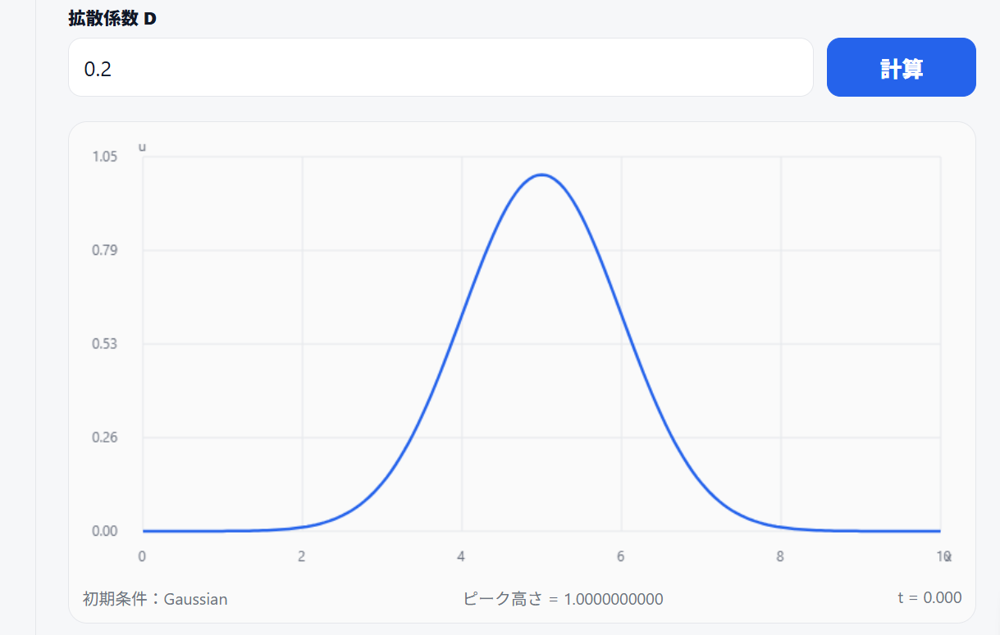
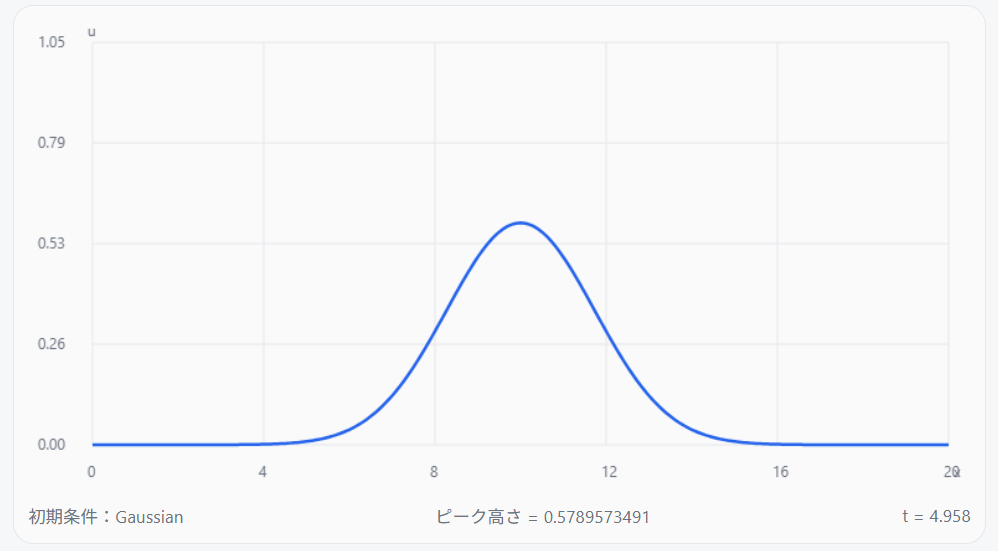
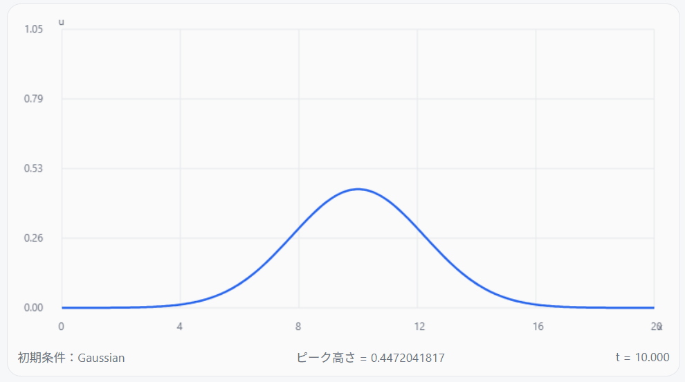
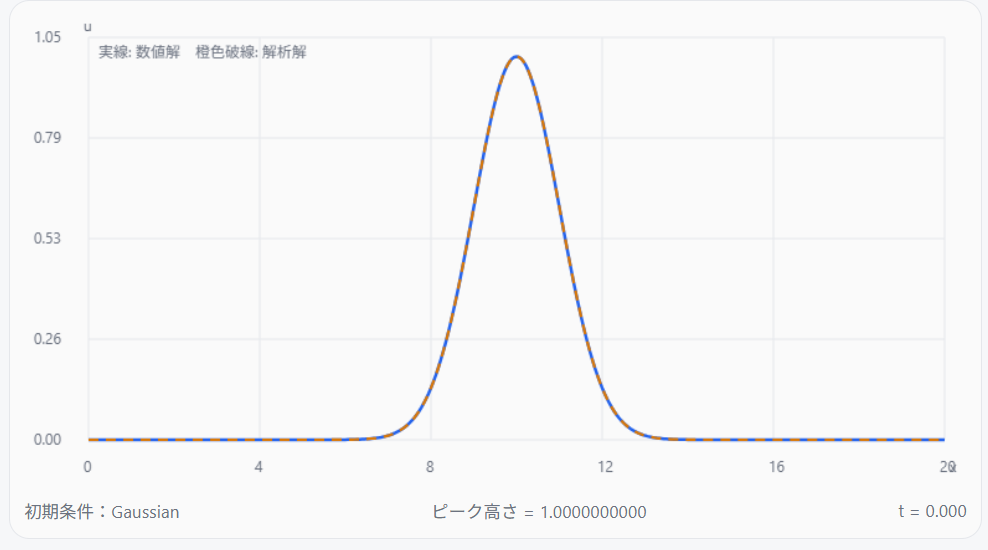
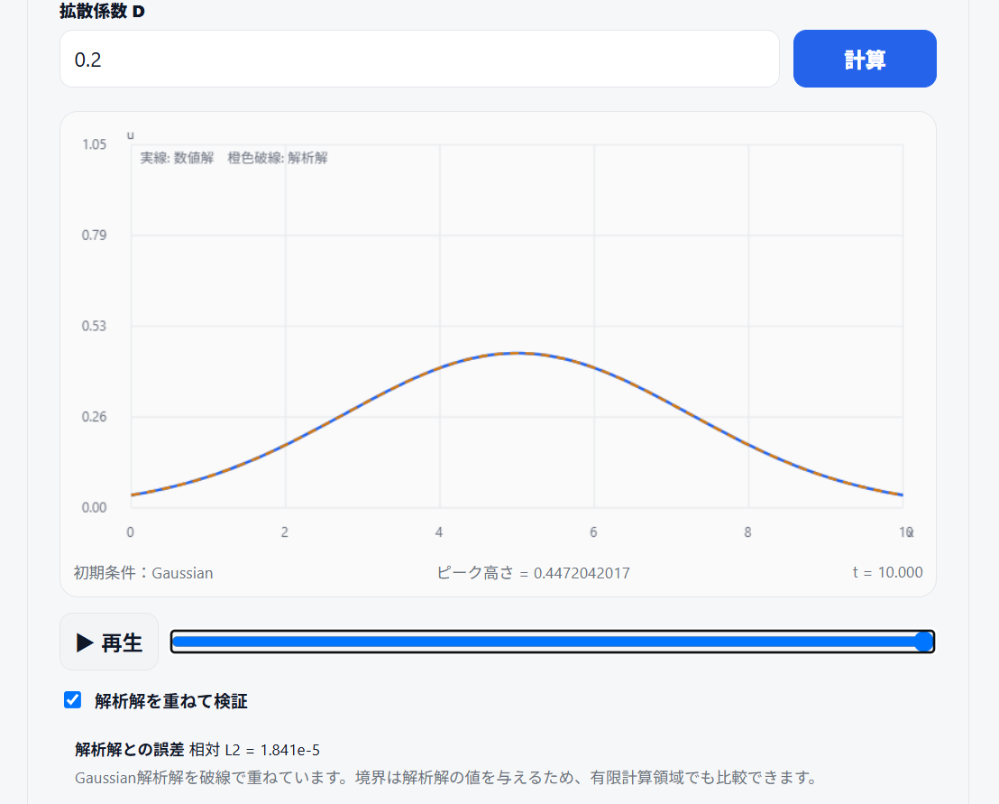

一次元拡散方程式シミュレータの結果およびその妥当性評価

0. 一次元拡散方程式シミュレータの結果
図１には

   $\frac{\partial u}{\partial t} = D \frac{\partial ^2 u}{\partial ^2 x} $
    
の形で表される，物理量
$u$
の一次元拡散方程式の初期状態のスナップショットを示す．
ここで，
$t$
は時間であり単位は秒， D は拡散係数であり単位はm²/sである．
またこのとき初期条件から，ピーク位置はx=5mであり，ピーク高さは1である（ここでは物理量uは無次元とする）．

||
|:--:|
| 図1: 初期条件のスナップショット |

図２には t≈5s および t=10s でのスナップショットを示す．

||
|:--:|
| 図２: 初期条件のスナップショット |

これらから，拡散方程式を解いた結果，時間の経過とともにピーク幅は広がりピーク高さは減少した．
以下では，この二点を解析解と比較することにより，数値計算の妥当性を検証する．

1. 拡散による物理的時間発展の確認

一次元拡散方程式

 $\frac{\partial u}{\partial t} = D \frac{\partial ^2 u}{\partial ^2 x} $

に対し、シミュレータでは初期条件として

    u(x,0) = exp[-(x-x0)²/(2σ0²)]

というGaussian分布を与えている。

この初期条件に対する無限領域の解析解は

    u(x,t)
    = σ0 / sqrt(σ0²+2Dt)
      × exp[-(x-x0)²/{2(σ0²+2Dt)}]

である。

この式から、Gaussianの幅を表す分散は

    σ²(t) = σ0² + 2Dt

となり、時間とともに増加する。一方、Gaussianの中心 x=x0 では指数関数部分が exp(0)=1 となるため、ピーク値は

    u_max(t)
    = σ0 / sqrt(σ0²+2Dt)

となる。

一次元拡散方程式シミュレータでは

    x0 = 5.0 m
    σ0 = 1,0 m

を用いている。また、標準設定として

    D = 0.20 m²/s

を用いる。

したがって t=10 s では

    σ²(10)
    = σ0² + 2Dt
    = 1² + 2×0.20×10
    = 5.0 m²

となる。これは拡散によるピーク幅の広がりを表す．

また、ピーク高さの解析値は

    u_max(10)
    = 1 / sqrt(5)
    ≈ 0.45 

と求められる。

同じ D=0.20、t=10 s の条件で一次元拡散方程式シミュレータを実行すると、数値計算から得られる中心最大値は

    u_max,num = 0.4472042017

であった（図２のt=10sのスナップショットより）。

したがって解析値との相対差は，u_max,numを数値計算によるピーク高さ，u_max,exactをピーク高さの解析解とすると，

   E = |u_max,num-u_max,exact| / u_max,exact

    = |0.4472042017-0.45| / 0.45
    ≈ 0.62 %

となる。

以上から、少なくともGaussianの幅の増大とピーク高さの低下という一次元拡散方程式の基本的な時間発展について、数値計算結果は解析的に予想される挙動と整合している。

2. 数値解と解析解を実際に重ねた確認

最後に、図３では実際に計算した数値解とGaussian解析解を同一グラフ上に重ねて比較した。
ここで数値解は青色実線，解析解は橙色破線で示す．
||
|:--:|
| 図３: 解析解と数値解の比較．初期条件（左）とt=10s(右)．青色実線：数値解，橙色破線：解析解．|

数値解と比較する解析解は

    u_exact(x,t)
    = σ0 / sqrt(σ0²+2Dt)
      × exp[-(x-x0)²/{2(σ0²+2Dt)}]

である。

標準設定

    D = 0.20
    格子点数 N = 181
    t = 10 s

において、数値解と解析解を比較した結果、両曲線はグラフ上でほぼ重なって表示された。

さらに、図より計算終了時の相対誤差

    E
    = sqrt[Σ_i (u_num,i-u_exact,i)²]
      / sqrt[Σ_i u_exact,i²]

を確認すると、t=10 sでは

    E_L2 = 1.841×10^-5

であった。

したがって、単にグラフの形が似ているだけではなく、数値的にも解析解との差は非常に小さい。

以上より、実際に一次元拡散方程式を解いた結果と解析解を重ねて比較した際、両者はよく一致していた。前節で確認したGaussianの理論的な時間発展とも整合していることから、今回検証した条件では、一次元拡散方程式シミュレータは拡散方程式の時間発展を適切に計算できていると判断できる。
